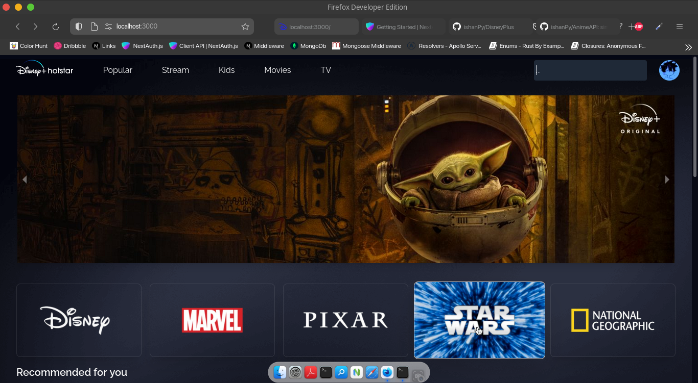

# DisneyPlus

Disney+ like-ish movie streaming web app made with Tailwind, Next, Apollo and TMDB !


## Documentation

[Documentation](https://ihaventmadeanydocsyetlol)


## Authors

- [@ishanPy](https://www.github.com/ishanPy)

## Run Locally

Clone the project

```bash
  git clone https://ishanPy/DisneyPlus
```

Go to the project directory

```bash
  cd app
```

Install dependencies

```bash
  npm install OR yarn add
```

Start the server

```bash
  npm run dev OR yarn dev
```


## Screenshots



## Used By

This project is used by the following people:

- me
- also me 

## Optimizations

- Added sharp for Image Optimizations
- Added ```react-svginline``` for SVG Optimizations

## Support

For support, email ishannagar84@gmail.com or join our Slack channel.


## License

[MIT](https://choosealicense.com/licenses/mit/)
